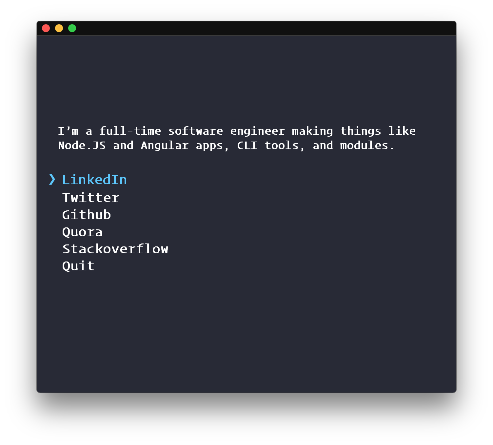

# VladBozhinovski [](https://travis-ci.org/VladBozhinovski/VladBozhinovski)




## Usage

Install Node.js, then:

```
$ npx vladbozhinovski/bozhinovski
```


## License

MIT © [Vladimir Bozhinovski]
